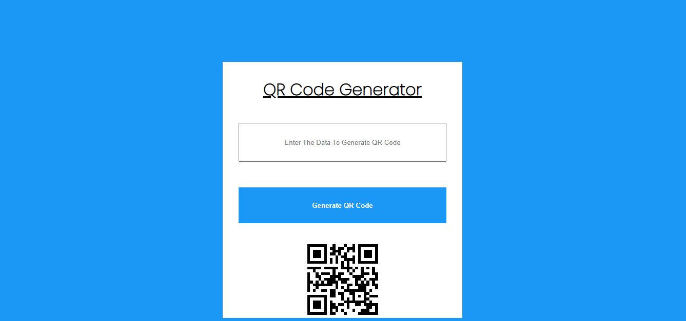

# PRANAV MATHUR

## Learnings from the project:

- Modifying CSS of an element using JavaScript
- Adding variables to URL to change API requests

## Time taken:

    It took me an hour to complete this project.

## Screenshots:

## Live link:

[Go to site](https://16-qr-code-generator.netlify.app/)
